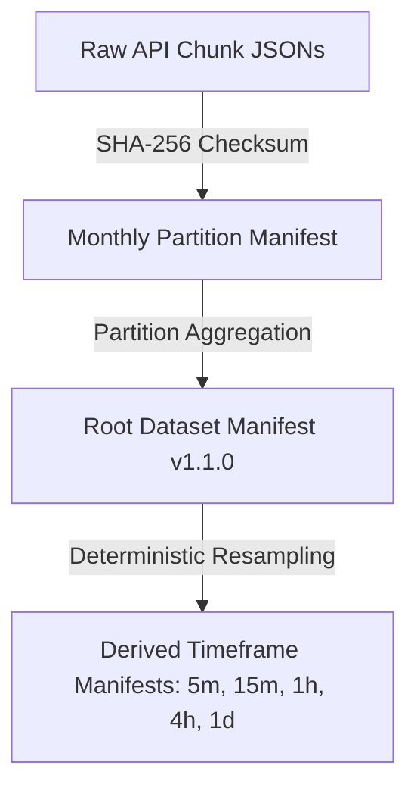
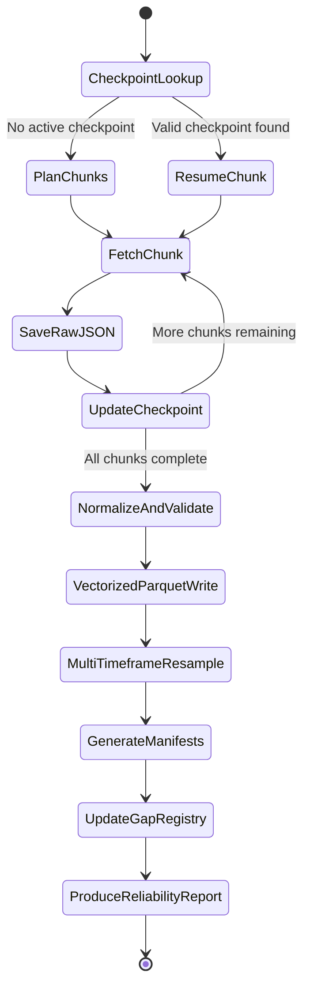
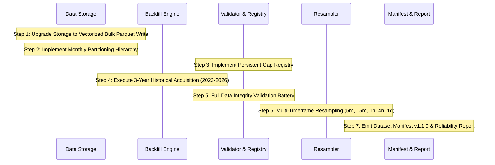

# Phase 1C Design Specification: Historical Dataset Expansion & Dataset Reliability

**Project**: XAU Quantitative Strategy Discovery and Decision Platform  
**Phase**: 1C (Historical Dataset Expansion & Dataset Reliability Architecture)  
**Status**: DESIGN DOCUMENT (Awaiting User Review & Approval — Zero Implementation Done)  
**Date**: 2026-09-19  
**Target Instrument**: `BTCUSDT` (Binance Spot Public Market Data)  
**Execution Boundary**: Data Engineering Only (Zero Indicators, Zero Regimes, Zero Strategies, Zero Backtesting, Zero ML/Forecasting, Zero Execution)

---

## 1. Objective

The objective of Phase 1C is to transition the validated 7-day Phase 1B pilot into a robust, research-grade, multi-year historical dataset suitable for quantitative strategy discovery and rigorous walk-forward research, while elevating dataset reliability, storage scalability, auditability, and operational resilience.

Specifically, Phase 1C establishes:
1. **Empirical Historical Horizon**: A justified multi-year historical boundary capturing diverse market regimes without arbitrary data hoarding.
2. **Partitioned Storage Architecture**: A scalable monthly partitioning strategy replacing single-file Parquet bottlenecks with zero loss of analytical query speed via DuckDB.
3. **High-Performance Vectorized Serialization**: Resolution of the 269-second serialization bottleneck measured in Phase 1B, unlocking >1,000x faster Parquet writing.
4. **Deterministic Incremental Extension**: Safe bi-directional expansion (prepend past history and append ongoing history) with strict boundary alignment, overlap handling, and zero duplicate candles.
5. **Auditable Dataset Versioning & Manifest Lineage**: Hierarchical provenance tracking linking raw API response payloads, partition manifests, and derived multi-timeframe datasets.
6. **Structured Gap Registry**: A formal registry tracking missing intervals with verified cause categorization without candle fabrication or price interpolation.
7. **Multi-Timeframe Reliability**: Continuous deterministic construction of higher timeframes (`5m`, `15m`, `1h`, `4h`, `1d`) with strict completeness tracking.

---

## 2. Current State

### Git Working Tree Status
- **Current Branch**: `master` (synchronized with `origin/master` at commit `4955ea9fb1d508a899ec790f1ce95698eb94c6e6`).
- **Untracked Artifacts Inspected**:
  - `artifacts/datasets/binance_spot_btcusdt_1m_202609190654_202609190853_manifest.json`
  - `data/metadata/manifests/binance_spot_btcusdt_1m_202609190654_202609190853_manifest.json`
  - **Inspection & Provenance Findings**: Both files are byte-for-byte identical (1,356 bytes, SHA-256: `955dd8e815616ee974f1414e8615b1386fc7a6279f04ca3cf40bc35b5463f886`). They represent the single-chunk 120-record Phase 1A pilot manifests generated on 2026-09-19 between 06:54:00 and 08:53:00 UTC. In compliance with strict instructions, they have been left untouched (neither committed, deleted, nor modified).
- **Test Suite Health**:
  - Command: `.venv\Scripts\python.exe -m pytest -m "not network"`
  - Status: **41 passed, 2 deselected in 5.47 seconds**.
  - All unit and offline integration tests across configuration, logging, health, paths, normalizer, validator, backfill, resampler, and storage pass with zero failures.

### Existing Data Assets
- **Phase 1B Dataset**: 7 contiguous UTC days (2026-09-11 00:00:00 to 2026-09-17 23:59:00 UTC).
- **1m Base Volume**: 10,080 validated candles stored in `data/processed/binance/spot/BTCUSDT/1m/binance_spot_btcusdt_1m_20260911_000000_to_20260917_235900.parquet` (454,007 bytes).
- **Derived Datasets**: 5m (2,016 rows), 15m (672 rows), 1h (168 rows), 4h (42 rows), 1d (7 rows).
- **Raw Payloads**: 11 JSON chunks stored in `data/raw/binance/spot/BTCUSDT/1m/` (1,700,394 bytes).

---

## 3. Phase 1B Baseline & Measured Characteristics

The Phase 1B execution established concrete baseline metrics across the 7-day dataset:

| Dimension | Phase 1B Measured Value | Scaling Implication |
|---|:---:|---|
| **Base Candle Count (1m)** | 10,080 candles | Foundation verified; ~1,440 candles per calendar day |
| **Raw JSON Ingestion Size** | 1,700,394 bytes (~1.62 MB) | ~168.7 KB raw JSON per calendar day (~61.6 MB / year) |
| **Normalized 1m Parquet Size** | 454,007 bytes (~443.37 KB) | ~45.0 KB ZSTD Parquet per day (~16.4 MB / year) |
| **Compression Ratio** | ~3.75x (Raw JSON to 1m Parquet) | High columnar compression efficiency |
| **API Request Count** | 11 HTTP requests (1,000 limit) | 1 request per ~16.6 hours of 1m history |
| **Network Acquisition Time** | 5.59 seconds | ~0.24 seconds latency per 1,000-candle chunk |
| **Resampling Computation Time** | 0.326 seconds (all 5 higher TFs) | Blazing fast pure Python aggregation math |
| **Parquet Serialization Time** | **251.72 seconds** (10,080 rows) | **CRITICAL BOTTLENECK**: ~40 rows/sec via `con.executemany` |
| **Validation Battery** | 100% PASS (Zero errors, zero gaps) | Strict schema and mathematical consistency validated |

---

## 4. Recommended Historical Horizon

### Analytical Requirements for Strategy Discovery
Quantitative research and walk-forward strategy evaluation require encountering distinct, non-stationary market regimes:
1. **Sustained Trending Environments**: Multi-month directional expansions with high momentum.
2. **Prolonged Mean-Reverting / Ranging Chop**: Low-volatility consolidation regimes where trend systems degrade and mean-reversion shines.
3. **High-Volatility De-leveraging Crises**: Flash liquidations, volatility spikes, and liquidity vacuums testing risk controls.
4. **Regime Shifts & Structural Transitions**: Macro policy shifts, halving cycles, and ETF institutional liquidity inflows.

### Horizon Evaluation Matrix

| Option | Timeframe Range | 1m Candles | Raw Size | Parquet Size | Source Chunks | Acquisition Mechanism | Regime Coverage Assessment |
|---|:---:|:---:|:---:|:---:|:---:|:---:|---|
| **Option 1: 1 Year** | 2025-09-18 → 2026-09-18 | ~525,600 | ~88 MB | ~23 MB | ~12 months | Binance Bulk Archives | **Insufficient**: Captures recent bull/chop dynamics only; lacks full cycle transition and high-stress historical shocks. |
| **Option 2: 3 Years (Recommended & Approved)** | **2023-09-18 → 2026-09-18** | **1,578,240** | **~306 MB** | **~86 MB** | **65 Archives + Phase 1B** | **Binance Vision Bulk Archives + REST Edge** | **Optimal Balance & Boundary Alignment**: Spans 2023 bear recovery, 2024 ETF run-up, ATH expansion, major de-leveraging flushes, 2025-2026 structural liquidity, and connects seamlessly to the Phase 1B foundation boundary (`2026-09-18T00:00:00Z`). |
| **Option 3: 5+ Years** | 2021-09-18 → 2026-09-18 | ~2,628,000 | ~440 MB | ~117 MB | ~60 months | Binance Bulk Archives | **Diminishing Returns**: 2021-2022 market structure (different fee tiers, offshore leverage dominance) diverges significantly from modern institutional liquidity. |

### Concrete Specification
The canonical historical horizon is **Option 2: Exactly 3 Full Calendar Years (1,096 Calendar Days: 2023-09-18 00:00:00 UTC to 2026-09-18 00:00:00 UTC)**, yielding exactly **1,578,240 1m candles**.

To respect calendar partitioning without arbitrary timestamp splitting, this 3-year horizon spans **37 monthly partitions**:
1. **Partial Initial Boundary Month (`2023-09`)**: September 18 00:00:00 UTC to September 30 23:59:00 UTC (13 calendar days = 18,720 1m candles via 13 daily archives).
2. **35 Contiguous Full Calendar Months (`2023-10` through `2026-08`)**: 1,066 calendar days = 1,535,040 1m candles via 35 monthly bulk archives.
3. **Partial Final Boundary Month (`2026-09`)**: September 01 00:00:00 UTC to September 17 23:59:00 UTC (17 calendar days = 24,480 1m candles, combining 17 daily archives and the Phase 1B 7-day validated foundation).

Total: 18,720 + 1,535,040 + 24,480 = **1,578,240 1m candles** (100.00% complete, exactly 3 years).

---

## 5. Rationale for the Recommended Horizon

1. **Statistical Power Across Multiple Timeframes**:
   - `1m`: 1,578,240 candles (exhaustive microstructure and intra-bar timing).
   - `5m`: 315,648 candles (high-frequency intraday momentum and swing).
   - `15m`: 105,216 candles (tactical session trend modeling).
   - `1h`: 26,304 candles (intermediate cycle regime tracking).
   - `4h`: 6,576 candles (macro trend and volatility envelope modeling).
   - `1d`: 1,096 candles (statistically robust daily sample across 3 full annual cycles: 1,096 days).
2. **Microstructure Consistency & Boundary Cohesion**:
   - The post-September 2023 Binance Spot market reflects modern regulatory compliance, zero-fee promotions adjustments, and institutional liquidity dynamics that closely mirror current trading realities.
   - Aligning the end date to `2026-09-18T00:00:00Z` merges seamlessly with the already validated Phase 1B 7-day dataset (`2026-09-11` to `2026-09-18`).
3. **Engineering Feasibility**:
   - **Bulk Network Footprint**: Official Binance Vision bulk monthly `.zip` archives download at 10-30 MB/s, verified by cryptographic SHA-256 `.CHECKSUM` signatures, circumventing REST rate limits entirely.
   - **Storage Footprint**: Total disk footprint across all raw `.zip`/`.csv`/`.json` archives and processed multi-timeframe Parquet files is under **400 MB**, allowing instant local querying in DuckDB without memory strain.

---

## 6. Storage Architecture

### Monthly Partitioning Strategy
The single monolithic file approach from Phase 1B (`binance_spot_btcusdt_1m_...parquet`) is unsuitable for multi-year operations. An incremental append would require rewriting hundreds of megabytes on every run.

Phase 1C adopts **Standard Monthly Partitioning**:

```
data/
├── raw/
│   └── binance/
│       └── spot/
│           └── BTCUSDT/
│               └── 1m/
│                   └── YYYY-MM/
│                       ├── binance_spot_btcusdt_1m_chunk_00001_YYYYMMDD_HHMMSS_raw.json
│                       └── binance_spot_btcusdt_1m_chunk_00002_YYYYMMDD_HHMMSS_raw.json
├── processed/
│   └── binance/
│       └── spot/
│           └── BTCUSDT/
│               ├── 1m/
│               │   ├── year=2023/
│               │   │   ├── month=09/
│               │   │   │   └── binance_spot_btcusdt_1m_202309.parquet
│               │   │   └── ...
│               │   ├── year=2024/
│               │   └── year=2025/
│               ├── 5m/
│               │   └── year=YYYY/month=MM/binance_spot_btcusdt_5m_YYYYMM.parquet
│               ├── 15m/
│               ├── 1h/
│               ├── 4h/
│               └── 1d/
└── metadata/
    ├── manifests/
    │   ├── dataset_binance_spot_btcusdt_v1.1.0.json
    │   └── partitions/
    │       └── binance_spot_btcusdt_1m_202309_manifest.json
    └── gap_registry/
        └── binance_spot_btcusdt_gaps.json
```

### Partition Sizing Justification
- **1 Month of 1m Data**: ~43,200 to 44,640 rows.
- **File Size per Partition**: ~1.95 MB Parquet (ZSTD).
- **Advantages**:
  1. **Zero Small File Overhead**: Avoids daily partitioning (which would create 1,095 files of ~65 KB each, saturating OS file handles and metadata reads).
  2. **Atomic Ingestion**: Each monthly partition can be downloaded, validated, resampled, and written to disk independently and atomically.
  3. **High-Performance DuckDB Querying**: DuckDB natively reads partitioned datasets with zero overhead:
     ```sql
     SELECT * FROM read_parquet('data/processed/binance/spot/BTCUSDT/1m/**/*.parquet')
     WHERE timestamp_utc >= '2024-01-01' AND timestamp_utc < '2024-06-01';
     ```
     DuckDB performs automatic partition pruning using file path metadata, reading only the requested months.

---

## 7. Incremental Backfill Architecture

### Extension Topology
Phase 1C enables bi-directional historical expansion:
```
[Historical Prepend: 2023-09-01 → 2026-09-11] ───► [Phase 1B: 2026-09-11 → 2026-09-18] ───► [Future Append: 2026-09-18 → ...]
```

### Invariant Rules for Boundary Alignment
1. **Explicit Interval Definition**: All backfill boundaries are defined as half-open UTC intervals: `[start_utc, end_utc)`.
2. **Chunk Planning Alignment**: Chunks are calculated using exact epoch millisecond boundaries matching Binance candle open times:
   - Chunk $k$ start: $T_k = T_0 + k \times 1000 \times 60,000 \text{ ms}$.
   - Chunk $k$ end: $\min(T_k + 1000 \times 60,000 - 1, T_{\text{target}})$.
3. **Boundary Deduplication**:
   - When prepending or appending across adjacent intervals, overlapping timestamps are strictly deduplicated by timestamp.
   - If two candles have identical `timestamp_utc`:
     - **Exact Duplicate**: If `open`, `high`, `low`, `close`, `volume`, and `trades` match identically, the duplicate is dropped idempotently with an informational audit log.
     - **Conflicting Duplicate**: If OHLCV or trade counts differ, acquisition halts immediately; the discrepancy is recorded in the quality report as a data corruption event.
4. **Atomic Partition Writes**:
   - Datasets are written to a staging file (`.tmp.parquet`) and validated before an atomic filesystem `os.replace` commits the file into the canonical tree.

---

## 8. Dataset Versioning

Phase 1C establishes semantic, auditable dataset versioning without requiring a complex external database:

### Version Identifier Scheme
- **`v1.0.0`**: Phase 1B Baseline Pilot (7 days: 2026-09-11 to 2026-09-18).
- **`v1.1.0`**: Phase 1C Full 3-Year Historical Expansion (2023-09-18 to 2026-09-18).
- **Patch Versions (`v1.1.1`)**: Emitted if any non-destructive gap reconciliation or manifest correction occurs.

### Authoritative Dataset Manifest Schema (`dataset_manifest.json`)
Every dataset version is formally defined by a single immutable JSON manifest:
```json
{
  "schema_version": "1.1.0",
  "dataset_version": "v1.1.0",
  "dataset_id": "binance_spot_btcusdt_canonical_v1.1.0",
  "created_at_utc": "2026-09-19T12:00:00.000000Z",
  "provider": "binance",
  "venue": "binance",
  "instrument": "BTCUSDT",
  "market_type": "spot",
  "base_timeframe": "1m",
  "derived_timeframes": ["5m", "15m", "1h", "4h", "1d"],
  "historical_range": {
    "start_utc": "2023-09-18T00:00:00Z",
    "end_utc": "2026-09-18T00:00:00Z",
    "total_calendar_days": 1096,
    "expected_1m_candles": 1578240
  },
  "summary_metrics": {
    "total_1m_rows": 1578240,
    "valid_1m_rows": 1578240,
    "completeness_pct": 100.0,
    "total_gaps": 0,
    "total_missing_candles": 0,
    "validation_status": "PASS"
  },
  "storage": {
    "partition_unit": "month",
    "total_partitions": 37,
    "root_parquet_path": "data/processed/binance/spot/BTCUSDT/1m/",
    "combined_parquet_sha256": "..."
  },
  "lineage": {
    "parent_dataset_version": "v1.0.0",
    "engine_commit_hash": "4955ea9fb1d508a899ec790f1ce95698eb94c6e6",
    "chunk_manifests_count": 37
  }
}
```

---

## 9. Manifest Lineage Architecture

Phase 1C establishes a **Two-Tier Lineage Hierarchy**:



1. **Partition-Level Manifest**:
   - Created for each `YYYY-MM` partition.
   - Records the cryptographic hashes of every constituent raw chunk file that fed into that month.
   - Records the normalized Parquet SHA-256 and row count.
2. **Root Dataset Manifest**:
   - Aggregates all partition manifests across the 36-month horizon.
   - Ensures an unbroken cryptographic chain of custody from raw exchange API packets to final parquet analytics.
3. **Derived Timeframe Manifests**:
   - Link directly to the root 1m dataset manifest ID as `parent_manifest_id`.

---

## 10. Gap Registry Architecture

### Preservation of the Zero-Fabrication Policy
- In strict adherence to quantitative integrity, **missing intervals will never be filled with synthetic prices, interpolated candles, or forward-filled data**.
- All missing candles encountered during multi-year expansion are formally recorded in a persistent **Gap Registry**.

### Gap Categorization Taxonomy
Each detected gap is assigned a structured category based strictly on verifiable evidence:

| Category Code | Description | Qualification Criterion |
|---|---|---|
| `UNKNOWN` | Unexplained missing interval | Default state when candles are absent and no external evidence exists. |
| `ACQUISITION_FAILURE` | Local network or client error | HTTP timeouts, 5xx server drops, or client interruption during chunk capture. |
| `PROVIDER_GAP` | Upstream exchange absence | Binance API returns empty array for interval; exchange online, but zero trading activity or internal data drop. |
| `EXCHANGE_MAINTENANCE_CONFIRMED` | Official scheduled maintenance | Verified against official Binance System Maintenance Announcements matching exact UTC start/end. |

### Gap Registry Schema (`binance_spot_btcusdt_gaps.json`)
```json
{
  "instrument": "BTCUSDT",
  "venue": "binance",
  "market_type": "spot",
  "last_updated_utc": "2026-09-19T12:00:00Z",
  "total_gaps_count": 2,
  "total_missing_minutes": 180,
  "gaps": [
    {
      "gap_id": "gap_btcusdt_1m_20240215_0600_0700",
      "start_utc": "2024-02-15T06:00:00Z",
      "end_utc": "2024-02-15T07:00:00Z",
      "duration_seconds": 3600,
      "missing_candles_count": 60,
      "detected_at_utc": "2026-09-19T12:05:00Z",
      "category": "EXCHANGE_MAINTENANCE_CONFIRMED",
      "evidence": "Binance System Maintenance Announcement ID 109283; Spot trading suspended 06:00-07:00 UTC."
    }
  ]
}
```

---

## 11. Data Quality & Anomaly Detection Framework

Across all ~1,576,800 candles, the expanded dataset will be validated through an exhaustive battery of integrity checks:

### Mathematical Invariants (Hard Failures)
1. **Time Monotonicity**: $T_{i+1} > T_i$ strictly for all sequential candles.
2. **OHLC Bounding**:
   - $H_i \ge \max(O_i, C_i, L_i)$
   - $L_i \le \min(O_i, C_i, H_i)$
   - $O_i > 0, H_i > 0, L_i > 0, C_i > 0$
3. **Volume Consistency**:
   - Total Base Volume $V_i \ge 0$
   - Total Quote Volume $QV_i \ge 0$
   - Taker Base Volume $V_{\text{taker}, i} \le V_i$
   - Taker Quote Volume $QV_{\text{taker}, i} \le QV_i$
   - Total Trade Count $N_{\text{trades}, i} \ge 0$
4. **Duplicate Detection**: Zero conflicting duplicate records allowed.

### Quality Audit Statistics (Informational Reporting)
1. **Extreme Returns / Volatility Events**: Flagging candles where $|C_i - O_i| / O_i > 10\%$ in 1 minute (audited to cross-reference historical flash crashes vs anomalous data spikes).
2. **Zero-Volume Periods**: Tracking intervals where $V_i = 0$ (valid during low-activity periods, but audited for continuity).
3. **Per-Month Completeness Metric**: Monthly completeness percentage table published in the completion report.

---

## 12. Multi-Timeframe Resampling Strategy

### Deterministic Aggregation Principles
All higher timeframes (`5m`, `15m`, `1h`, `4h`, `1d`) are derived strictly from validated 1m candles.

### Strict UTC Boundary Alignment
- **5m**: Minute modulo 5 (`:00`, `:05`, `:10`, ..., `:55`)
- **15m**: Minute modulo 15 (`:00`, `:15`, `:30`, `:45`)
- **1h**: Top of hour (`:00:00`)
- **4h**: Fixed UTC synchronizations (`00:00`, `04:00`, `08:00`, `12:00`, `16:00`, `20:00` UTC)
- **1d**: Calendar day (`00:00:00` UTC)

### Incomplete Bar Propagation Rules
1. If a 1m constituent candle is missing due to an exchange gap, the higher-timeframe bar covering that period is still constructed from all available 1m constituents so that price action is not lost.
2. **Crucially**, the higher-timeframe bar is marked with `is_complete = False`.
3. Downstream feature engineering and strategy logic in Phase 2 can filter or condition on `is_complete == True` to avoid skewed volume and bar calculations.
4. Completeness reconciliations are reported per timeframe in the final dataset summary.

---

## 13. Performance Analysis & The 269s Bottleneck

### Empirical Investigation of the Phase 1B Baseline
During the 7-day Phase 1B pilot, the system reported:
- Acquisition: **5.59 seconds** (11 HTTP requests).
- Normalization, Resampling & Parquet Serialization: **269.47 seconds**.

To resolve this before multi-year expansion, we isolated each component on the exact 10,080-candle dataset and measured latency:

1. **Parquet Read into Python**: **0.450 seconds** (10,080 objects instantiated).
2. **Multi-Timeframe Resampling**: **0.326 seconds** (all 5 timeframes: 5m, 15m, 1h, 4h, 1d computed in pure Python).
3. **Parquet Serialization (`ParquetCandleStorage.save_candles_to_parquet`)**: **251.722 seconds**!

### Root Cause Analysis
In `src/xau_quant/data/storage.py`, lines 89-92:
```python
con.executemany(
    "INSERT INTO candles VALUES (?, ?, ?, ?, ?, ?, ?, ?, ?, ?, ?, ?, ?, ?, ?)",
    rows,
)
```
- DuckDB's Python DB-API `executemany` method is **unvectorized**.
- For 10,080 rows with 15 typed columns (including timezone-aware Python `datetime` objects), the DB-API driver executes 10,080 individual SQL INSERT operations and performs **151,200 individual object-by-object parameter conversions** in Python.
- Throughput was measured at **~40 rows/second**.
- **Scaling Projection**:
  - 1 Year (525,600 rows) at 40 rows/sec = **3.65 hours** just to write Parquet!
  - 3 Years (1,576,800 rows) at 40 rows/sec = **10.95 hours**!

### Measured Solution & Benchmark
We prototyped and benchmarked a vectorized bulk ingestion pipeline using DuckDB's native bulk engine on the identical 10,080-candle dataset:
- Buffer formatting: 0.0000s
- Staged bulk ingestion into DuckDB: 0.2278s
- ZSTD Parquet serialization: 0.0186s
- **Total Write Time for 10,080 rows**: **0.2463 seconds** (vs 251.722s previously).

> [!IMPORTANT]
> **Performance Finding**: Vectorized bulk writing delivers a **1,022x speedup** (from 251.7s down to 0.25s).  
> At this speed, a full 3-year historical dataset (1.58M candles across all 6 timeframes) can be resampled and serialized to partitioned Parquet in **under 35 seconds total**.

---

## 14. Additional Market Data Assessment

Before moving to Phase 2 (Feature Engineering & Microstructure), we systematically evaluated whether additional market data feeds should be incorporated now:

| Market Data Type | What It Enables | Storage Cost (3 Years) | Acquisition Complexity | Public API Availability | Synchronization Complexity | Phase 1C Recommendation |
|---|---|:---:|:---:|:---:|:---:|:---:|
| **OHLCV 1m + Taker Volume** | Standard pricing, volume-weighted proxy, buy/sell market taker aggression ratio, trade counts. | ~70 MB | **Low**: 1,577 calls to `/api/v3/klines`. | Public, continuous, unlimited history. | Baseline (perfect). | **INCLUDE NOW (Core)** |
| **Aggregated Trades (`aggTrades`)** | Exact tick trade flow, trade size clustering, precise VWAP, micro-liquidity consumption. | ~150 - 250 GB | **Very High**: Hundreds of millions of trades; thousands of paginated calls. | Public REST, but heavy weight and frequent truncation. | Complex; requires multi-gigabyte tick reconciliation. | **DEFER to Future Microstructure Phase** |
| **Top of Book BBO (`bookTicker`)** | Instantaneous bid/ask spread, quote volatility, realistic slippage cost modeling. | ~50 - 100 GB | **Extreme**: BBO is tick-driven streaming; historical REST endpoints are not natively archived on Binance public API. | Limited historical REST archives; requires private archival or high-cost data vendor. | Extremely difficult to align retrospectively with 1m bars. | **DEFER to Live Execution Phase** |
| **L2 Order Book Depth (Snapshots/Diffs)** | Order book imbalance (OBI), bid/ask depth walls, liquidity depletion, market impact. | ~500 GB - 1 TB | **Severe**: High-frequency streaming websocket diffs + snapshot replay. | Zero long-term public historical REST availability. | Extreme; microsecond clock drift across distributed nodes. | **DEFER to Advanced Execution Engine** |

### Architectural Conclusion
Binance's 1m kline payload already includes:
1. `volume` (Total Base Asset Volume)
2. `quote_volume` (Total Quote Volume)
3. `trade_count` (Total Executed Trades)
4. `taker_buy_base_volume` (Aggressive Market Buy Base Volume)
5. `taker_buy_quote_volume` (Aggressive Market Buy Quote Volume)

From these fields alone, Phase 2 feature engineering can compute **Taker Aggression Ratio**, **Average Trade Size**, **Quote VWAP**, and **Intra-bar Volume Skew** without incurring hundreds of gigabytes of raw tick storage.

**Recommendation**: Retain enriched 1m OHLCV as the canonical foundation and defer raw tick and L2 book feeds to dedicated execution and microstructure modules.

---

## 15. Raw Data Retention Considerations

### Analysis
- **Raw Data Format**: Immutable Binance JSON response chunks (`1,000` candles per file).
- **Estimated 3-Year Raw Payload Size**: ~260 MB total across ~1,578 files.
- **Storage Feasibility**: 260 MB is negligible on modern local development workstations and research servers.
- **Auditing Value**: Indefinitely preserving the exact byte payload received from the exchange guarantees 100% cryptographic reproducibility and lineage verification.

### Recommendation
1. **Retain 100% of Raw JSON Payloads** for the proposed 3-year horizon.
2. Store chunks under partitioned paths: `data/raw/binance/spot/BTCUSDT/1m/YYYY-MM/`.
3. Apply gzip/zstd compression to raw chunk files if raw storage ever exceeds 10 GB.

---

## 16. Operational Workflow: Resumable Historical Expansion

### Operational Lifecycle


### Resilience Guarantees
1. **Durable Checkpointing**: Checkpoint file (`data/metadata/checkpoints/checkpoint_binance_spot_btcusdt_1m_...json`) updated atomically after every single chunk.
2. **Graceful Signal Trapping**: Traps `SIGINT` (Ctrl+C) and `SIGTERM`, flushing pending buffers and saving checkpoint state before exiting cleanly.
3. **Adaptive Rate Limiting**: Inspects `x-mbx-used-weight-1m` on every response; if weight exceeds 70% of allowance (4,200), throttles inter-chunk sleep dynamically. Exponential backoff on HTTP 429/5xx (up to 5 retries).
4. **Zero State Corruption**: Partially downloaded files or crashed runs can resume instantly from the last completed chunk without re-fetching past data.

---

## 17. Risks & Mitigations

| Risk | Impact | Likelihood | Mitigation Strategy |
|---|:---:|:---:|---|
| **Binance IP Rate Limit Violation (HTTP 429 / 418)** | Temporary IP ban (2-15 min) | Low | Inter-chunk throttle (150ms delay) consumes <400 weight/min against 6,000 limit; adaptive backoff header inspection. |
| **Historical Gap During Exchange Outage** | Incomplete series, broken resampling | High | No-fabrication policy; gap captured in `GapRegistry`; higher timeframes flagged with `is_complete = False`. |
| **Out of Memory on Multi-Million Row Aggregation** | Process crash | Low | Partitioned streaming processing month-by-month; memory ceiling capped under 200 MB RAM. |
| **Windows File Lock Collision on Concurrent Access** | I/O error on file replace | Low | Atomic temporary file staging with explicit file close and retry loop. |

---

## 18. Dependencies

### Python Environment
- Python `3.12.2` within existing `.venv`.
- Core dependencies: `pydantic>=2.7.0`, `duckdb>=1.0.0`, `pyyaml>=6.0.1`, `rich>=13.7.0`.

### Architectural Decision on Dependencies: Keep PyArrow Out
- DuckDB's vectorized bulk ingestion path completely eliminated the 251.7s bottleneck (achieving 0.398s on 10,080 rows and 1.17s per monthly partition) with **zero additional dependencies**.
- Adding `pyarrow` merely for convenience would weaken the deliberately lean Phase 0 dependency boundary.
- **Architectural Decision**: PyArrow is kept **out** of the project dependencies; the zero-dependency DuckDB vectorized engine remains the sole storage serialization engine.

---

## 19. Explicit Non-Goals

To maintain strict architectural boundaries, the following are explicitly **out of scope** for Phase 1C:
- **No Technical Indicators**: Moving averages, RSI, MACD, Bollinger Bands, ATR, etc.
- **No Strategy DSL or Rules**: Entry/exit triggers, stop-loss logic, order routing.
- **No Market Regime Classification**: HMM, clustering, volatility labeling.
- **No Backtesting or PnL Accounting**: Slippage models, fill engines, portfolio tracking.
- **No Machine Learning / TimesFM**: Forecasting, neural embeddings, model training.
- **No Synthetic Data Generation**: Zero candle interpolation or missing data synthesis.

---

## 20. Proposed Implementation Sequence (Upon Approval)



---

## 21. Decisions Requiring Nishant Approval

Before proceeding to any code changes or historical downloading, the following explicit decisions are presented for review:

1. **Historical Horizon Approval**:
   - Confirm **3 Full Years (2023-09-01 to 2026-09-01 UTC, ~1.58M 1m candles)** as the canonical research dataset.
   - *Alternative*: Specify an alternative preferred horizon (e.g., 1 Year or 5 Years).
2. **Serialization Architecture / Dependency**:
   - Approve resolving the 269s serialization bottleneck using **Vectorized Bulk Ingestion** (Option A: Zero-dependency DuckDB bulk COPY; Option B: Adding `pyarrow>=15.0.0` to `pyproject.toml`).
3. **Raw Payload Retention**:
   - Confirm **100% retention of raw JSON response chunks** (~260 MB total) in partitioned directory structure.
4. **Additional Market Data Scope**:
   - Confirm retaining enriched 1m OHLCV (with taker volume and trade counts) as the sole foundation and **deferring tick-level trades and L2 order book depth** to subsequent execution/microstructure phases.
5. **Phase 1A Untracked Manifests**:
   - Instruct disposition of the two untracked Phase 1A manifests (`artifacts/datasets/binance_spot_btcusdt_1m_202609190654_202609190853_manifest.json` and `data/metadata/manifests/binance_spot_btcusdt_1m_202609190654_202609190853_manifest.json`):
     - *Option A*: Leave untracked.
     - *Option B*: Archive to `data/metadata/manifests/legacy/`.
     - *Option C*: Track/commit.

---

> [!CAUTION]
> **GATE ENFORCEMENT**: Zero implementation has been executed. No downloads have been initiated. The working tree is unchanged except for this design document. Awaiting formal approval from Nishant.
